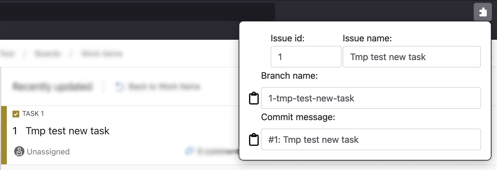

# sogos-issue-name-helper

## Supported Issue Tracking Systems
- GitHub
- Jira
- Azure DevOps
- Trello
- Redmine



## Prepare environment for development
### 1. Install Node.js 16.16.0
### 2. Install web-ext
``` bash
npm install --global web-ext
```

## Run extension for local testing
``` bash
web-ext run
```

## Build extension
``` bash
web-ext build --artifacts-dir ./artifacts --overwrite-dest
```
